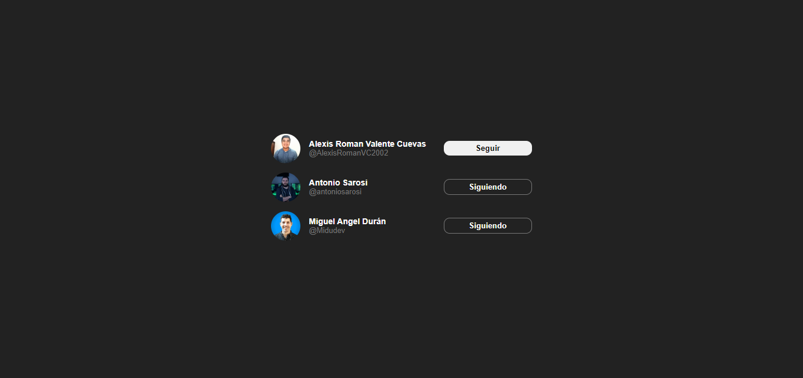
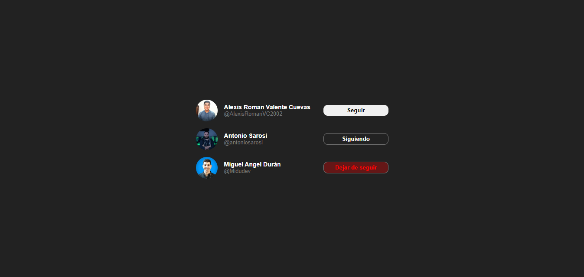
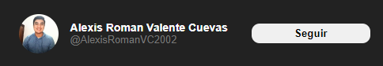

# MY FIRST COMPONENT IN REACT
This is the code on a component in "React", I used react and jsx to be able to build it, this component is used in twitter when it is shown when you want to follow a person or unfollow him, for its operation I used props and states (useState).

# Desmotration of the component in operation:

